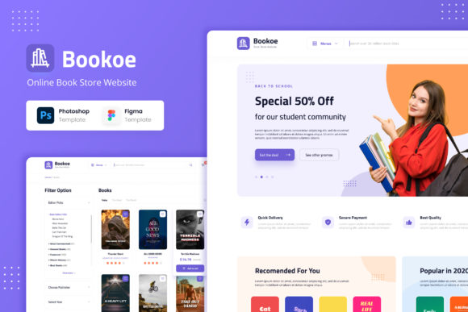

# Bookoe

## Obline Book Store Website

## Project Title: Bookoe Book Store Website Development

### Project Overview:
Bookoe Book Store is a popular online platform for purchasing books. The website needs to be revamped and developed using React to enhance its user experience and provide a modern, responsive, and efficient interface for book enthusiasts.

### Project Goals:
- Create a user-friendly and responsive web application that allows users to browse, search, and purchase books.
- Implement an efficient book catalog system with detailed book listings.
- Enable users to create accounts, log in, and manage their profiles.
- Implement a shopping cart and checkout system for purchasing books.
- Provide a review and rating system for books.
- Integrate a search feature to allow users to find books by title, author, genre, or keyword.
- Implement a secure authentication and authorization system.
- Ensure the website is SEO-friendly for better visibility in search engines.
- Optimize performance for fast loading times.

### Technical Requirements:
- Front-end Technology: Use React for building the front-end of the website.
- State Management: Implement state management using Redux or React Context API.
- User Authentication: Integrate user authentication using Firebase Authentication or a similar service.
- Database: Use Firebase Firestore or another suitable database for storing book and user data.
- Responsive Design: Ensure the website is responsive and compatible with various devices and screen sizes.
- UI/UX Design: Create a modern and visually appealing user interface following best practices for UX design.
- API Integration: Connect to external book APIs (e.g., Google Books API) for fetching book data.
- Shopping Cart: Implement a shopping cart feature to allow users to add and remove items.
- Payment Integration: Integrate a payment gateway (e.g., Stripe) for handling book purchases securely.
- Reviews and Ratings: Allow users to rate and review books.
- Search Functionality: Implement a robust search system with filters.
- Pagination: Implement pagination for long lists of books.
- Authentication Middleware: Develop middleware to ensure secure routes.
- Security: Implement security best practices to protect user data and payment information.
- Performance Optimization: Optimize the website's performance for fast loading times.
- SEO: Implement SEO best practices for better search engine ranking.
- Testing: Conduct unit testing and integration testing of components and features.
- Documentation: Provide clear and comprehensive documentation for the codebase.

### Useful libs:
- [React](https://react.dev)
- [Vite](https://vitejs.dev/)
- [Vitest](https://vitest.dev)
- [Redux Toolkit with Query](https://redux-toolkit.js.org) or [Tanstack Query](https://tanstack.com/query/latest) with [Axios](https://axios-http.com)
- [Storybook](https://storybook.js.org)
- [Ahooks](https://ahooks.js.org)
- [Firebase](https://firebase.google.com) or [JSON Server](https://github.com/typicode/json-server)

[Figma URL](https://www.figma.com/file/XjxaJ6tz3XyHeq2fyrqNEq/Bookoe_BookStoreWebsite_AllPage?type=design&node-id=0%3A1&mode=design&t=kSkf7BFCSWW13KXf-1)
